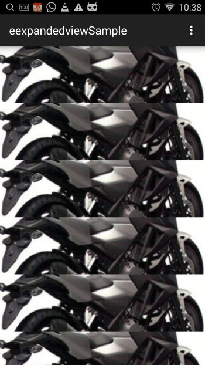

Expandable Catelog View [](https://android-arsenal.com/api?level=16)
========
The java library to delivery slick nice expandable widget view. FB Spring Featured Widget.


ABOUT
------
If you have a need to have a UI component which can be add as a part of the container layout, you can programmatically adding fragment into the header. This way you can do more interactions anyhow you like.

 


CUSTOMIZATION FOR STANDALONE HARDCODE IMPLEMENATION
------
```xml


```


GRADLE COMING SOON
------

```gradle

```


USAGE BY HARD CODE
------

```xml
    <com.hb.hkm.hkmeexpandedview.CatelogView
        android:id="@+id/expandble_item"
        android:layout_width="100dp"
        android:layout_height="100dp"
        android:descendantFocusability="blocksDescendants"
        app:red="213"
        app:blue="213"
        app:green="213"
        app:src="@drawable/your_image_here"
        app:childlayout="@layout/flip_text_view_front_layout"
        />
```

BUILD LAYOUT PROGRAMMICALLY
------
[Default Presentation](https://github.com/jjhesk/expandableWidget/wiki#default-sample-code)

[Advanced Presentation](https://github.com/jjhesk/expandableWidget/wiki#advanced-sample-code)

[Fragment Implementations](https://github.com/jjhesk/expandableWidget/wiki#advanced-sample-code)
License
----------

```
Copyright 2014 HESKeyo

Licensed under the Apache License, Version 2.0 (the "License");
you may not use this file except in compliance with the License.
You may obtain a copy of the License at

http://www.apache.org/licenses/LICENSE-2.0

Unless required by applicable law or agreed to in writing, software
distributed under the License is distributed on an "AS IS" BASIS,
WITHOUT WARRANTIES OR CONDITIONS OF ANY KIND, either express or implied.
See the License for the specific language governing permissions and
limitations under the License.
```
